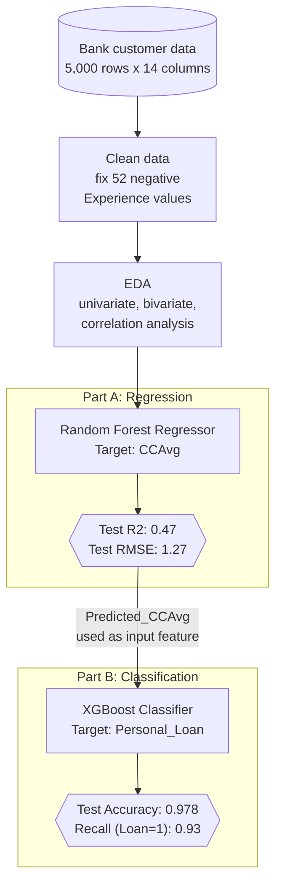
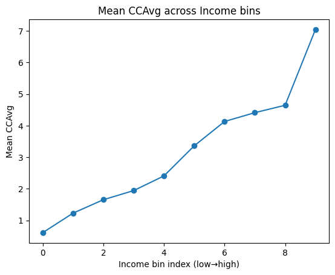
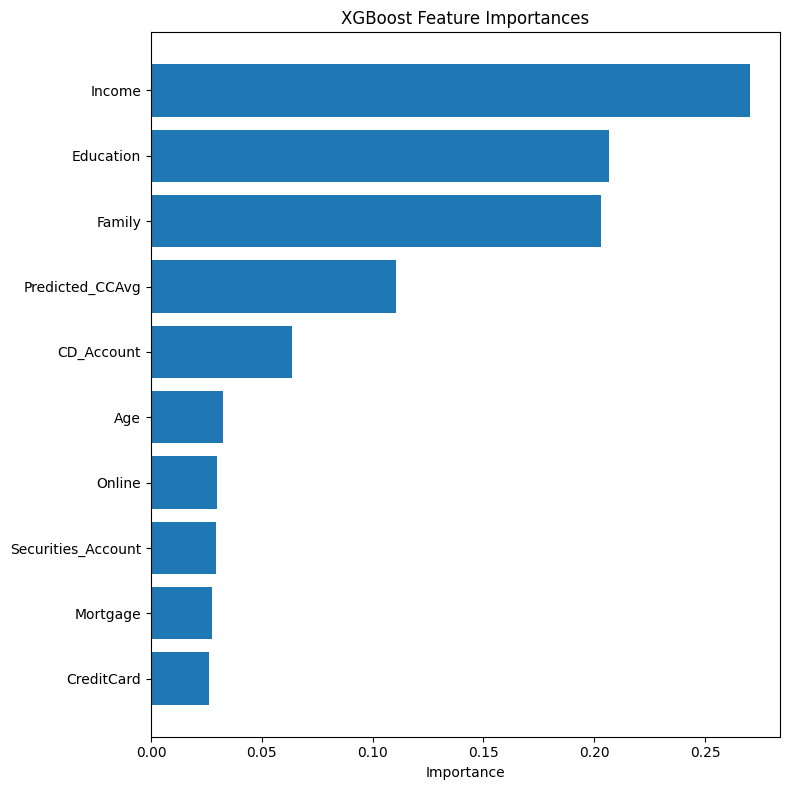
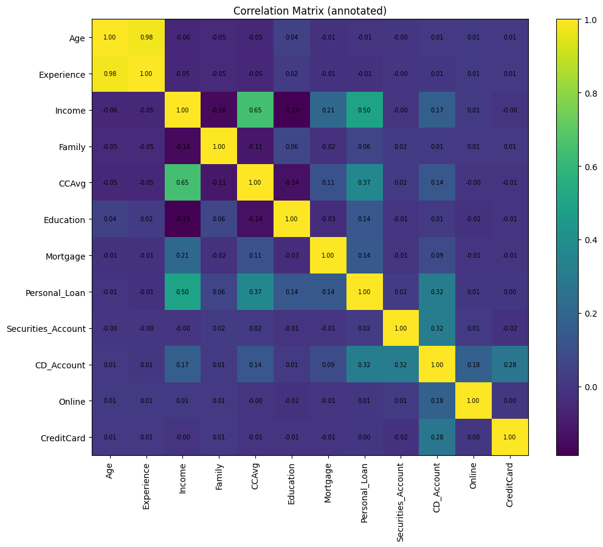

# Loan Modeling - Two-Stage Prediction Pipeline

A two-stage machine learning pipeline on bank customer data: predict how much a customer spends on their credit card, then use that prediction to identify who's likely to accept a personal loan offer. Built as my contribution to a team project (Week 2), covering the modeling half of the pipeline.

## Problem

Two linked prediction tasks:

- **Part A (Regression):** predict `CCAvg` (average monthly credit card spend) from customer attributes.
- **Part B (Classification):** predict `Personal_Loan` (will this customer accept a loan offer), using the *predicted* CCAvg from Part A instead of the real one, to avoid leaking the answer.



## Dataset

5,000 bank customers, 14 columns: age, experience, income, family size, education, mortgage, credit card spend, and existing account/product flags. 52 rows had negative "Experience" values, fixed by replacing with the median.

## Part A: predicting credit card spend

Random Forest Regressor on `CCAvg`.

| Metric | Train | Test |
|---|---:|---:|
| RMSE | 0.82 | 1.27 |
| R2 | 0.78 | 0.47 |

The gap between train and test R2 shows some overfitting, expected given how noisy individual spending behavior is. Income is the main driver:



## Part B: predicting loan acceptance

XGBoost Classifier on `Personal_Loan`, using `Predicted_CCAvg` (not the real value) as a feature. The dataset is imbalanced, about 90% of customers don't take the loan, so precision/recall on the minority class matters more than raw accuracy.

| Metric | Value |
|---|---:|
| Accuracy | 0.978 |
| Precision (Loan = 1) | 0.85 |
| Recall (Loan = 1) | 0.93 |
| F1 (Loan = 1) | 0.89 |

Income again comes out as the strongest predictor, followed by education and family size:



Variable correlations across the full dataset:



## Business takeaways

1. Income drives both credit card spend and loan acceptance, it's the single most useful signal in this dataset.
2. The engineered `Predicted_CCAvg` feature carries real signal for loan targeting, tying spending behavior to loan interest.
3. Given the class imbalance, recall on likely-to-accept customers matters more than overall accuracy for a marketing campaign, missing a real prospect costs more than a wasted outreach.

## Tools

Python, pandas, scikit-learn (Random Forest), XGBoost, matplotlib.

## Setup

```bash
poetry install
poetry run jupyter notebook loan_modeling.ipynb
```

Note: the raw dataset (`Loan_Modelling.xlsx`) isn't included in this repo, so the notebook won't re-run end-to-end as-is. The commands above set up the environment used; the notebook itself is best viewed on GitHub for the code, charts, and output already saved in it.

## Files

`loan_modeling.ipynb` has the full workflow: data cleaning, EDA, both models, and evaluation.
